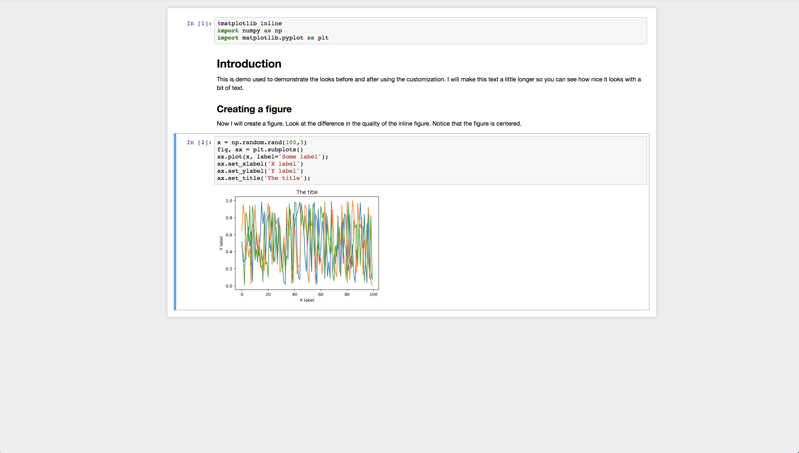
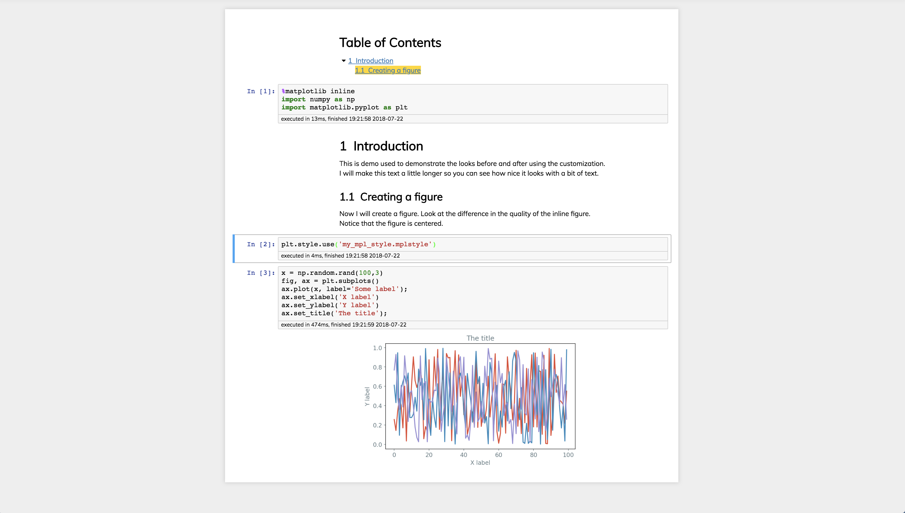

# Introduction

This repository contains a collection of dot files and other tricks for customizing the look and workflow of Jupyter Notebooks. I have created [a Notebook](https://github.com/mikkelhartmann/configuring-jupyter-notebook/blob/master/configuring-jupyter-notebook.ipynb) that demonstrates how this works. This is still very much work in progress as I'm constantly learning new cool things about Jupyter Notebook.

The changes amount to editing or creating the following files:

1.  `~/.jupyter/nbconfig/notebook.json`: This file contains a list of all the Notebook Extensions I use. The extensions could also be enabled using the extension manager.
1.  `~/.jupyter/custom/custom.css`: A file that includes the CSS used to render the notebook. I use this file to set the width and alignment of the different kinds of cells.
1.  `~/.ipython/profile_default/ipython_config.py`: A file which contains the default settings for how figures are shown in the notebook. I use it to increase the quality of the figures.
1.  `~/.config/matplotlib/stylelib/my_mpl_style.mplstyle`: A file that that changes the default parameters for matplotlib.pyplot. This means that we can have a custom and consistent look across all our notebooks.

The documentation on how to configure Jupyter Notebook can bbe found [here](https://jupyter-notebook.readthedocs.io/en/stable/config_overview.html?highlight=configuration). The same goes for IPython [here](https://ipython.readthedocs.io/en/stable/config/index.html?highlight=configuration). For how to customize matplotlib styles, see [this description of style sheets](https://matplotlib.org/users/style_sheets.html) as well as [this](https://matplotlib.org/tutorials/introductory/customizing.html).

## Before

## After

